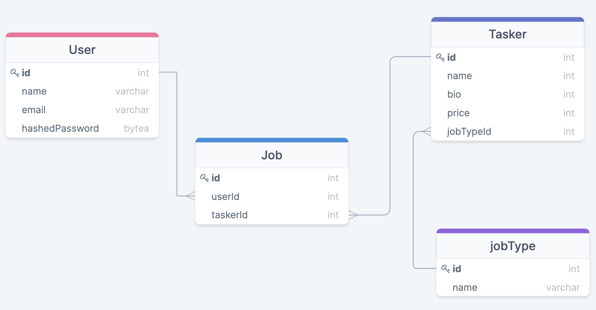

# TaskDragon Wiki

Welcome to the TaskDragon Wiki!.

This is a full-stack web application built using JavaScript, HTML5, & CSS (frontend) and Express, Sequelize, & PostgreSQL (backend)

This application is currently hosted on Heroku! [YeOldeTaskDragon](https://yeoldetaskdragon.herokuapp.com/home)

 

## MVP Feature List:

**As a** user, **I want** to be able to select a task **so that** I can be provided with an appropriate list of possible taskers, including price and skill level.
* Estimated Time: 2 days
* Dates: Aug 10-11

**As a** user, **I want** to be able to filter/sort further the tasker list **so that** I can view a list ordered by my preferences.
* Estimated Time: 0.5 days
* Dates: Aug 12

**As a** user, **I want** to be able to select a tasker, (at which time I’ll be prompted to create a user account, if not done already) **so that** I can plan on having the task done on a particular date for a particular price and specify details about the job.
* Estimated Time: 1 days
* Dates: Aug 12-13

**As a** user, **I want** to be able to access my account **so that** I can view, manage, and cancel jobs and view/edit my account details (e.g., name, password, email, address, phone number, etc).
* Estimated Time: 1.5 days
* Dates: Aug 13-14

### Stretch Goals:

**As a** tasker, **I want** to be able to create a profile (inputting my skills and hourly rate) **so that** I can get matched with potential customers and accept/reject the job.

**As a** user, **I want** to be able to specify a day/time for the task, **so that** it happens according to my desired schedule.

 

## Database Model:

 

 

## RESTful EndPoints:

| Method         | Path              | Purpose              |
|---             |---                |---                   |
| Get            | /                 |  Home Page           |
| Post           | /users            |  Create User Account |
| Get            | /users/:id        |  Access User Account |
| Get            | /users/sign-up    |  Create User Form    |
| Get            | /users/sign-in    |  User Login Form     |
| Post           | /users/sign-in    |  Authenticate User   |
| Get            | /users/:id/update |  Form to Update Account Details |
| Get            | /users/:id/jobs   |  View a list of past/present jobs |
| Patch          | /users/:id        |  Update User Account |
| Delete         | /users/:id        |  Delete User Account |
| Get            | /jobTypes         |  Show All job Types  |
| Get            | /jobTypes/:id     |  Show All taskers for job Type |
| Get            | /jobTypes/:id/:taskerId |  Show details about tasker  |
| Post           | /jobs             |  Create new job (user & tasker)  |

Site used for making embeddable images: https://www.labnol.org/embed/google/photos/
