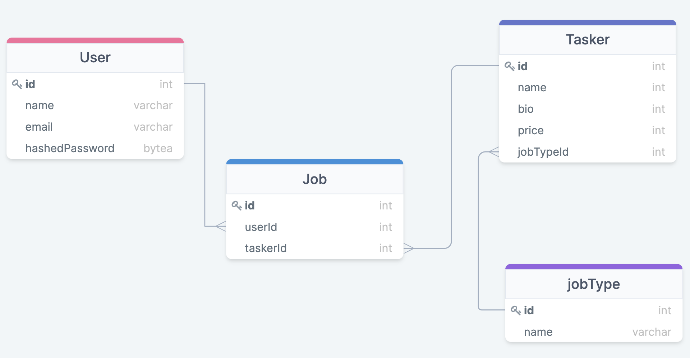

# TaskRabbit Feature List

## MVP:

**As a** user, **I want** to be able to select a task **so that** I can be provided with an appropriate list of possible taskers, including price and skill level.
* Estimated Time: 2 days
* Dates: Aug 10-11

**As a** user, **I want** to be able to filter/sort further the tasker list **so that** I can view a list ordered by my preferences.
* Estimated Time: 0.5 days
* Dates: Aug 12

**As a** user, **I want** to be able to select a tasker, (at which time I’ll be prompted to create a user account, if not done already) **so that** I can plan on having the task done on a particular date for a particular price and specify details about the job.
* Estimated Time: 1 days
* Dates: Aug 12-13

**As a** user, **I want** to be able to access my account **so that** I can view, manage, and cancel jobs and view/edit my account details (e.g., name, password, email, address, phone number, etc).
* Estimated Time: 1.5 days
* Dates: Aug 13-14

## Stretch:

**As a** tasker, **I want** to be able to create a profile (inputting my skills and hourly rate) **so that** I can get matched with potential customers and accept/reject the job.

**As a** user, **I want** to be able to specify a day/time for the task, **so that** it happens according to my desired schedule.

## Database Model:

## MVP EndPoints:

| Method         | Path              | Purpose              |
|---             |---                |---                   |
| Get            | /                 |  Home Page           |
| Post           | /users            |  Create User Account |
| Get            | /users/:id        |  Access User Account |
| Get            | /users/sign-up    |  Create User Form    |
| Get            | /users/sign-in    |  User Login Form     |
| Post           | /users/sign-in    |  Authenticate User   |
| Get            | /users/:id/update |  Form to Update Account Details |
| Get            | /users/:id/jobs   |  View a list of past/present jobs |
| Patch          | /users/:id        |  Update User Account |
| Delete         | /users/:id        |  Delete User Account |
| Get            | /jobTypes         |  Show All job Types  |
| Get            | /jobTypes/:id     |  Show All taskers for job Type |
| Get            | /jobTypes/:id/:taskerId |  Show details about tasker  |
| Post           | /jobs             |  Create new job (user & tasker)  |

 

## Additional Concerns:

A) MAJOR FUNCTIONALITY:
1) (stretch) provide a Tasker with almost all abilities of a user
  (creating a  account, logging in, participating in the
  job-scheduling negotiation, deleting a job, deleting themself)
2) If we don't want to do the stretch, then create an "admin" page
  with full CRUD-functionality for the Jobtype and Tasker Models.

B) MINOR FUNCTIONALITY (SPECIFIC):
2) put nav links on all pages to places like home, account details,
  or jobs
4) (PK) on jobs page, create a three-set toggle which'll show
  the following jobs according to their #jobDate attribute:
  (a) all of them, (b) past, and (c) future
5) (PK) separate "account" route into front-end & back-end?
6) (PK) put csrf middleware into a couple of routes, both
  front and back?
7) PK things: allow user to delete job &/or modify jobDate
(prob not, because sequelize disappears join PKs),
insert more nav links on each page, work on admin page,

C) MINOR FUNCTIONALITY (GENERAL):

D) HOUSEKEEPING:
1) shift image files "down" one level, as PK described earlier
2) delete superfluous paths
3) revisit naming conventions for paths?
4) delete comments, unless they help to read surrounding code
5) DRY code (js, css, and pug)
